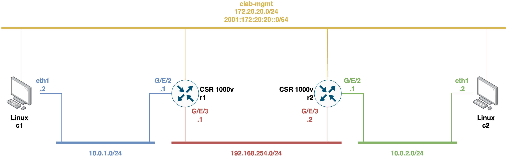
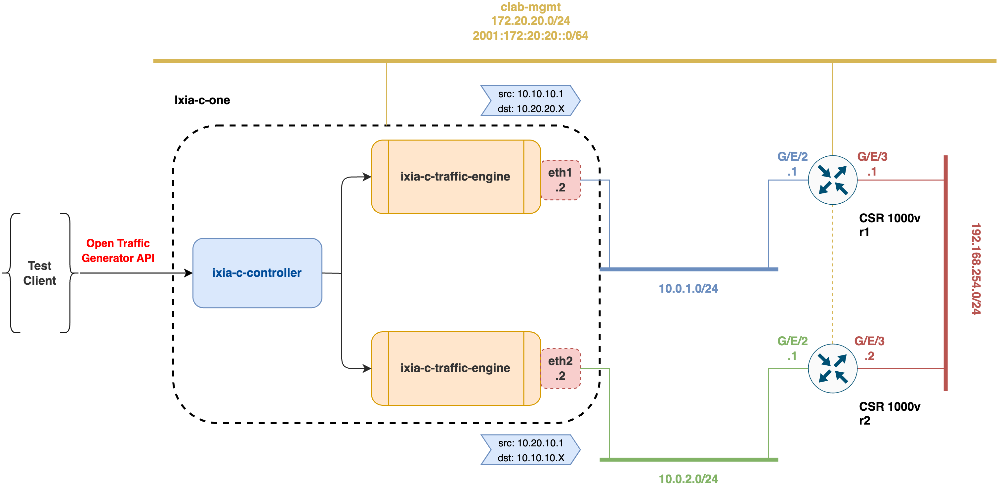

# ContainerLab testbeds for studying and analyzing telemetry services over NETCONF/YANG

This repository includes [ContainerLab](https://containerlab.dev/install/) testbeds for studying and analyzing Model-Driven Telemetry _(a.k.a. MDT)_ and network management mechanisms using the NETCONF protocol ([RFC 6241](https://datatracker.ietf.org/doc/html/rfc6241)) and the YANG data modeling language ([RFC 7950](https://datatracker.ietf.org/doc/html/rfc7950)).

# Table of Contents

- [ContainerLab testbeds for studying and analyzing telemetry services over NETCONF/YANG](#containerlab-testbeds-for-studying-and-analyzing-telemetry-services-over-netconfyang)
- [Table of Contents](#table-of-contents)
- [Prerequisites](#prerequisites)
- [Telemetry testbed topology](#telemetry-testbed-topology)
  - [Deploying, playing with, and destroying the topology](#deploying-playing-with-and-destroying-the-topology)
    - [Building custom Docker image for Linux clients](#building-custom-docker-image-for-linux-clients)
    - [Deploying the topology](#deploying-the-topology)
    - [Interacting with containers](#interacting-with-containers)
    - [Creating YANG-Push subscriptions to telemetry data through the NETCONF protocol](#creating-yang-push-subscriptions-to-telemetry-data-through-the-netconf-protocol)
    - [Creating queries to get and set configuration information and to get operational status data through the NETCONF protocol](#creating-queries-to-get-and-set-configuration-information-and-to-get-operational-status-data-through-the-netconf-protocol)
    - [Destroying the topology](#destroying-the-topology)
- [IXIA-C laboratory topology](#ixia-c-laboratory-topology)
  - [Deploying, playing with, and destroying the topology](#deploying-playing-with-and-destroying-the-topology-1)
    - [Deploying the topology](#deploying-the-topology-1)
    - [Interacting with containers](#interacting-with-containers-1)
    - [Generating synthetic traffic with IXIA-C](#generating-synthetic-traffic-with-ixia-c)
    - [Destroying the topology](#destroying-the-topology-1)
    - [Playing with YANG-Push subscriptions and query operations using NETCONF protocol](#playing-with-yang-push-subscriptions-and-query-operations-using-netconf-protocol)
- [Extra information](#extra-information)
    - [Known limitations about YANG-Push](#known-limitations-about-yang-push)
    - [ContainerLab documentation](#containerlab-documentation)
    - [IXIA-C additional documentation](#ixia-c-additional-documentation)
    - [vrnetlab additional documentation](#vrnetlab-additional-documentation)
    - [Jinja additional documentation for network automation](#jinja-additional-documentation-for-network-automation)
    - [ncclient additional documentation](#ncclient-additional-documentation)
    - [CISCO YANG Suite](#cisco-yang-suite)
    - [Related and interesting RFCs](#related-and-interesting-rfcs)
    - [Related and interesting links with additional information](#related-and-interesting-links-with-additional-information)

# Prerequisites

- Docker: https://docs.docker.com/engine/install/
- ContainerLab: https://containerlab.dev/install/
- A CISCO IOS XE qcow2 image for CSR 1000v devices must be converted and imported so it can be used with ContainerLab: https://github.com/hellt/vrnetlab/tree/master/csr. _Tested with IOS XE CSR1000v 17.3.4a (a.k.a. 17.03.04a) and IOS XE CSR1000v 17.3.6 (a.k.a. 17.03.06)_.
- Python 3 (_Tested with version Python 3.8.10_)
- Python library for NETCONF client _ncclient_: https://github.com/ncclient/ncclient
- Go (_Tested with version 1.20.3_)

# Telemetry testbed topology



## Deploying, playing with, and destroying the topology

### Building custom Docker image for Linux clients

```
$ cd docker/
$ sudo docker build -t girosdit/clab-telemetry-testbed-ubuntu:latest .
```

### Deploying the topology

To deploy the topology, simply run the deploy shell script:
```
$ ./deploy-testbed-lab.sh
```

### Interacting with containers

For **CSR routers**, via SSH to open the CISCO CLI (password is `admin`):
```
$ ssh admin@clab-telemetry-testbed-r1 # For r1 router

(or)

$ ssh admin@clab-telemetry-testbed-r2 # For r2 router
```

or with `docker exec` to open an interactive `bash` Linux shell:
```
$ sudo docker exec -it clab-telemetry-testbed-r1 bash # For r1 router

(or)

$ sudo docker exec -it clab-telemetry-testbed-r2 bash # For r2 router
```

For **Linux containers (clients)**, with `docker exec` to open an interactive shell:
```
$ sudo docker exec -it clab-telemetry-testbed-c1 /bin/sh # For c1 client container

(or)

$ sudo docker exec -it clab-telemetry-testbed-c2 /bin/sh # For c2 client container
```

### Creating YANG-Push subscriptions to telemetry data through the NETCONF protocol

In this testbed, `YANG-Push` ([RFC 8641](https://datatracker.ietf.org/doc/html/rfc8641)) subscriptions can be triggered to telemetry data from the Cisco IOS XE CSR1000V network devices, which support YANG data modeling language, via the NETCONF protocol. A NETCONF client Python library called [`ncclient`](https://ncclient.readthedocs.io/en/latest/) is used which supports all operations and capabilities defined by NETCONF ([RFC 6241](https://datatracker.ietf.org/doc/html/rfc6241)). This library allows to create dynamic susbcription to YANG modeled data by means of RPC operations in order to receive notifications. The subscription can be of the _on-change_ type or _periodic_ type, and depending on the data to subscribe to, one type of subscription or another will be accepted (see the [Known limitations about YANG-Push](#known-limitations-about-yang-push) section for more details).

There is a simple Python script [`ncclient-scripts/csr-create-subscription.py`](ncclient-scripts/csr-create-subscription.py) which allows you to make on-change or periodic subscriptions to an XPath of a specific YANG model for a Cisco IOS XE CSR1000V node. The script allows parameterizing the container name of the network device, the XPath, the type of subscription, and the time of the subscription period in centiseconds in the case of periodic subscriptions.

To create a `YANG-Push` subscription, run the Python script as follows:
```
$ python3 csr-create-subscription.py <container_name> <XPath> <subscription_type> [<period_in_cs>]
```

> **Periodic subscription example:**
> 
>```
>$ python3 csr-create-subscription.py clab-telemetry-testbed-r1 "/interfaces-state/interface[name='GigabitEthernet2']" periodic 1000
>```
 
> **On-change subscription example:**
> 
>```
>$ python3 csr-create-subscription.py clab-telemetry-testbed-r1 "/native/hostname" on-change
>```

Note that there is an alternative python script [`ncclient-scripts/csr-create-subscription-jinja2.py`](ncclient-scripts/csr-create-subscription-jinja2.py) which allows the parameterization of the `YANG-Push` subscription data via a [`Jinja`](https://jinja.palletsprojects.com/) template decoupled from the Python source code. The regarding Jinja template is available [here](ncclient-scripts/jinja2-templates/yang-push-subscriptions.xml).

### Creating queries to get and set configuration information and to get operational status data through the NETCONF protocol

In this testbed, RPC operations can be triggered to get configuration information and operational status data from the Cisco IOS XE CSR1000V network devices, which support YANG data modeling language, via the NETCONF protocol. The NETCONF client Python library called [`ncclient`](https://github.com/ncclient/ncclient) is used which supports all operations and capabilities defined by NETCONF ([RFC 6241](https://datatracker.ietf.org/doc/html/rfc6241)). This library supports the following NETCONF query operations:

- `edit-config` operation to set the configuration data. It uses a filter to edit only part of the configuration. There is a simple Python script [`ncclient-scripts/csr-create-query-edit-config-hostname.py`](ncclient-scripts/csr-create-query-edit-config-hostname.py) that allows you to edit the hostname of a Cisco IOS XE CSR1000V node by making use of the [`Cisco-IOS-XE-native`](yang/csr1000v/Cisco-IOS-XE-native%402020-07-04.yang) YANG model. The script allows parameterizing the container name of the network device and the desired hostname to be configured. To create the `edit-config` operation to configure the hostname of the network device, run the Python script as follows:
```
$ python3 csr-create-query-edit-config-hostname.py <container_name> <hostname>
```

> **Example:**
> 
>```
>$ python3 csr-create-query-edit-config-hostname.py clab-telemetry-testbed-r1 r1-ios-xe-csr1000v
>```

- `get-config` operation to retrieve the configuration data. It uses a filter to retrieve only part of the configuration. There is a simple Python script [`ncclient-scripts/csr-create-query-get-config-hostname.py`](ncclient-scripts/csr-create-query-get-config-hostname.py) that allows you to get the hostname of a Cisco IOS XE CSR1000V node by making use of the [`Cisco-IOS-XE-native`](yang/csr1000v/Cisco-IOS-XE-native%402020-07-04.yang) YANG model. The script allows parameterizing the container name of the network device. To create the `get-config` operation to get the hostname configuration of the network device, run the Python script as follows:
```
$ python3 csr-create-query-get-config-hostname.py <container_name> 
```

> **Example:**
> 
>```
>$ python3 csr-create-query-get-config-hostname.py clab-telemetry-testbed-r1
>```

- `get` operation to retrieve the configuration and state data. It uses a filter to specify the portion of the configuration and state data to retrieve. There is a simple Python script [`ncclient-scripts/csr-create-query-get-interface-ietf.py`](ncclient-scripts/csr-create-query-get-interface-ietf.py) that allows you to get the interface configuration and operational status information of a Cisco IOS XE CSR1000V node by making use of the [`ietf-interfaces`](yang/csr1000v/ietf-interfaces%402014-05-08.yang) YANG model. The script allows parameterizing the container name of the network device and optionally the name of the specific interface from which we want to obtain the configuration and operational status information. If no interface is specified, the resulting information will be returned for all available interfaces on the network device. To create the `get` operation to get the interface configuration and operational status information of the network device, run the Python script as follows:
```
$ python3 csr-create-query-get-interface.py <container_name> [<interface_name>]
```

> **Example for the GigabitEthernet1 interface:**
> 
>```
>$ python3 csr-create-query-get-interface-ietf.py clab-telemetry-testbed-r1 GigabitEthernet1
>```

> **Example for all interfaces:**
> 
>```
>$ python3 csr-create-query-get-interface-ietf.py clab-telemetry-testbed-r1
>```

Note that for the parameterization of the previous Python scripts that automate the different query operations, [`Jinja`](https://jinja.palletsprojects.com/) templates decoupled from the Python source code have been used. The regarding Jinja templates are available [here](ncclient-scripts/jinja2-templates/).

### Destroying the topology

To destroy the topology, simply run the destroy shell script:
```
$ ./destroy-testbed-lab.sh
```

# IXIA-C laboratory topology
This lab consists of a [`Keysight ixia-c-one`](https://containerlab.dev/manual/kinds/keysight_ixia-c-one/) node with 2 ports connected to incoming port on `r1` node and the outgoing port on `r2` node via two point-to-point ethernet links. The nodes are also connected with their management interfaces to the containerlab docker network. This lab is based on the [_Keysight IXIA-C and Nokia SR Linux_](https://containerlab.dev/lab-examples/ixiacone-srl/) lab example of ContainerLab.

`Keysight ixia-c-one` is a single-container distribution of [ixia-c](https://github.com/open-traffic-generator/ixia-c), which in turn is Keysight's reference implementation of [Open Traffic Generator API](https://github.com/open-traffic-generator/models). 

This lab allows users to validate an IPv4 traffic forwarding scenario between Keysight `ixia-c-one` and Cisco IOS XE CSR1000v nodes (i.e., `r1` and `r2`).



## Deploying, playing with, and destroying the topology

### Deploying the topology

To deploy the topology, simply run the deploy shell script:
```
$ ./deploy-ixiac-lab.sh
```

### Interacting with containers

For **CSR routers**, via SSH to open the CISCO CLI (password is `admin`):
```
$ ssh admin@clab-telemetry-ixiac-lab-r1 # For r1 router

(or)

$ ssh admin@clab-telemetry-ixiac-lab-r2 # For r2 router
```

or with `docker exec` to open an interactive `bash` Linux shell:
```
$ sudo docker exec -it clab-telemetry-ixiac-lab-r1 bash # For r1 router

(or)

$ sudo docker exec -it clab-telemetry-ixiac-lab-r2 bash # For r2 router
```

For **IXIA-C container**, with `docker exec` to open an interactive shell:
```
$ sudo docker exec -it clab-telemetry-ixiac-lab-ixia-c /bin/sh
```

Inside the ixia-c container shell, with `docker ps -a` you can see the `ixia-c controller` and `traffic engine` containers:
```
/home/keysight/ixia-c-one # docker ps -a
CONTAINER ID   IMAGE                            COMMAND                  CREATED        STATUS        PORTS                                            NAMES
1137908238a7   ixia-c-traffic-engine:1.4.1.23   "./entrypoint.sh"        27 hours ago   Up 27 hours                                                    ixia-c-port-dp-eth2
f33030b44e60   ixia-c-traffic-engine:1.4.1.23   "./entrypoint.sh"        27 hours ago   Up 27 hours                                                    ixia-c-port-dp-eth1
7a4a64439484   ixia-c-controller:0.0.1-2755     "./bin/controller --…"   27 hours ago   Up 27 hours   0.0.0.0:443->443/tcp, 0.0.0.0:50051->50051/tcp   ixia-c-controller
```

### Generating synthetic traffic with IXIA-C

This lab demonstrates a simple IPv4 traffic forwarding scenario where,

- One `Keysight ixia-c-one` port acts as a transmit port and the other as receive port. Two-way communication can be configured (i.e., `ixia-c-port1` <-> `r1` <-> `r2` <-> `ixia-c-port2`).
- Cisco IOS XE CSR1000v nodes (i.e., `r1` and `r2`) are configured to forward the traffic in either of the two directions of communication using static routes configuration in the default network instance.

When the lab is running, we need to fetch the MAC address according to the incoming interface of the router node which is connected to the transmit port of `ixia-c-one` node. Execute the following script to get the incoming MAC addresses of both router nodes, as they will serve as an argument in the traffic test scripts:
```
$ ./discover_target_mac.sh
```

Run the traffic tests with MAC addresses obtained in previous step:

- For the traffic test `ixia-c-port1` -> `r1` -> `r2` -> `ixia-c-port2`:
```
cd ixia-c-scripts/
go run ipv4_forwarding_r1_r2.go -dstMac="<incoming MAC address of r1>"
```

- For the traffic test `ixia-c-port2` -> `r2` -> `r1` -> `ixia-c-port1`:
```
cd ixia-c-scripts/
go run ipv4_forwarding_r2_r1.go -dstMac="<incoming MAC address of r2>"
```

The tests are configured to send 1000 IPv4 packets with a rate 100pps from 10.10.10.1 to 10.20.20.`X` or from 10.20.20.1 to 10.10.10.`X`, where `X` is changed from 1 to 5. Once 1000 packets are sent, the test script checks that we received all the sent packets.

### Playing with YANG-Push subscriptions and query operations using NETCONF protocol

As with the [initial testbed](#telemetry-testbed-topology), this network lab supports MDT and network management mechanisms using the NETCONF protocol and the YANG data modeling language. On the one hand, to play with `YANG-Push` subscriptions via the NETCONF protocol in order to monitor telemetry data from network devices go [here](#creating-yang-push-subscriptions-to-telemetry-data-through-the-netconf-protocol). On the other hand, to play with query operations via the NETCONF protocol to get and set configuration information and to get operational status data from network device go [here](#creating-queries-to-get-and-set-configuration-information-and-to-get-operational-status-data-through-the-netconf-protocol).

> **Note:**
>
> Remember that the name assigned by ContainerLab to the nodes or network devices in this network lab is different.

### Destroying the topology

To destroy the topology, simply run the destroy shell script:
```
$ ./destroy-ixiac-lab.sh
```

# Extra information

## Known limitations about YANG-Push

- `YANG-Push` on-change notifications do not work with all datastores. There is a proposed-standard method to know which YANG modules support this kind of notifications (see RFC 9196 linked below), but it is not implemented, at least in the 17.03.04a and 17.03.06 versions of CISCO's IOS XE network operating system. YANG modules `ietf-interfaces`, `openconfig-interfaces` and `cisco-ios-xe-interfaces-oper` do not allow this type of notifications, not even for `oper/admin-status` nodes. Periodic notifications work without issues. According to RFC 8641, page 17, chapter 3.10 (also linked below), "_a publisher supporting on-change notifications may not be able to push on-change updates for some object types_", and some reasons for this are given. While there is an additional method to, apparently, know which modules support on-change notifications (`show platform software ndbman {R0|RP} models` command in IOS CLI) (see [this link](https://www.cisco.com/c/en/us/td/docs/ios-xml/ios/prog/configuration/1612/b_1612_programmability_cg/model_driven_telemetry.html#id_90796)), it does not seem to match the experimented results.

## ContainerLab documentation

- ContainerLab home page: https://containerlab.dev/
- VM-based routers integration: https://containerlab.dev/manual/vrnetlab/
- Linux containers: https://containerlab.dev/manual/kinds/linux/
- Keysight IXIA-C One container: https://containerlab.dev/manual/kinds/keysight_ixia-c-one/
- Usage with Keysight IXIA-C traffic generator: https://containerlab.dev/lab-examples/ixiacone-srl/

## IXIA-C additional documentation

- Ixia-c _"A powerful traffic generator based on Open Traffic Generator API"_: https://github.com/open-traffic-generator/ixia-c
- Deploy Ixia-c-one using ContainerLab: https://github.com/open-traffic-generator/ixia-c/blob/main/docs/deployments.md#deploy-ixia-c-one-using-containerlab
- Open Traffic Generator (OTG): https://github.com/open-traffic-generator
- Open Traffic Generator APIs & Data Model: https://otg.dev/

## vrnetlab additional documentation

- vrnetlab - VR Network Lab: https://github.com/vrnetlab/vrnetlab
- vrnetlab - VR Network Lab (ContainerLab fork): https://github.com/hellt/vrnetlab

## Jinja additional documentation for network automation

- Jinja Documentation: https://jinja.palletsprojects.com/
- Jinja2 Tutorial - A Crash Course for Beginners: https://ultraconfig.com.au/blog/jinja2-a-crash-course-for-beginners/
- Python Automation on Cisco Routers in 2019 - NETCONF, YANG & Jinja2: https://ultraconfig.com.au/blog/python-automation-on-cisco-routers-in-2019/

## ncclient additional documentation

- ncclient: Python library for NETCONF clients: https://github.com/ncclient/ncclient
- ncclient documentation: https://ncclient.readthedocs.io/en/latest/
- Open Management - ncclient: https://aristanetworks.github.io/openmgmt/examples/netconf/ncclient/

## CISCO YANG Suite

Web-based GUI and set of tools to perform NETCONF/RESTCONF/gNMI/gRPC operations supported over YANG modules.

- Official GitHub repository with installation instructions: https://github.com/CiscoDevNet/yangsuite
- Official documentation: https://developer.cisco.com/docs/yangsuite/

## Related and interesting RFCs

- RFC 6020: YANG - A Data Modeling Language for the Network Configuration Protocol (NETCONF): https://datatracker.ietf.org/doc/html/rfc6020
- RFC 7950: The YANG 1.1 Data Modeling Language: https://datatracker.ietf.org/doc/html/rfc7950
- RFC 6241: Network Configuration Protocol (NETCONF): https://datatracker.ietf.org/doc/html/rfc6241
- RFC 6242: Using the NETCONF Protocol over Secure Shell (SSH): https://datatracker.ietf.org/doc/html/rfc6242
- RFC 8641: Subscription to YANG Notifications for Datastore Updates: https://datatracker.ietf.org/doc/html/rfc8641
- RFC 9196: YANG Modules Describing Capabilities for Systems and Datastore Update Notifications: https://datatracker.ietf.org/doc/html/rfc9196

## Related and interesting links with additional information

- CISCO DevNet Sandbox: https://developer.cisco.com/site/sandbox/
- CISCO IOS XE Model Driven Telemetry (for version 17.3.X): https://www.cisco.com/c/en/us/td/docs/ios-xml/ios/prog/configuration/173/b_173_programmability_cg/model_driven_telemetry.html
- CISCO IOS XE Programmability Configuration Guide - NETCONF Protocol (for version 16.7.X): https://www.cisco.com/c/en/us/td/docs/ios-xml/ios/prog/configuration/167/b_167_programmability_cg/configuring_yang_datamodel.html?bookSearch=true
- ContainerLab: CISCO CSRs in containers?!: https://devnetdan.com/2021/12/15/containerlab-cisco-csrs-in-containers/
- Cisco CSR 1000v and Cisco ISRv Software Configuration Guide: https://www.cisco.com/c/en/us/td/docs/routers/csr1000/software/configuration/b_CSR1000v_Configuration_Guide.pdf
- CISCO Networking Learning Labs: https://developer.cisco.com/learning/search/categories/Networking/
- How to Configure a Cisco CSR device using NETCONF/YANG: https://www.fir3net.com/Networking/Concepts-and-Terminology/how-to-configure-a-cisco-csr-using-netconf-yang.html
- YANG Models GitHub repository: https://github.com/YangModels/yang
- YANG Catalog Search: https://yangcatalog.org/yang-search
- Andrés Ripoll's TFG GitHub repository: https://github.com/andresripoll/TFG_NETCONF
- NETCONF Telemetry PoC: https://github.com/giros-dit/netconf-telemetry-poc
- Model-driven Telemetry: IETF YANG Push and/or Openconfig Streaming Telemetry?: https://www.claise.be/model-driven-telemetry-ietf-yang-push-and-or-openconfig-streaming-telemetry/